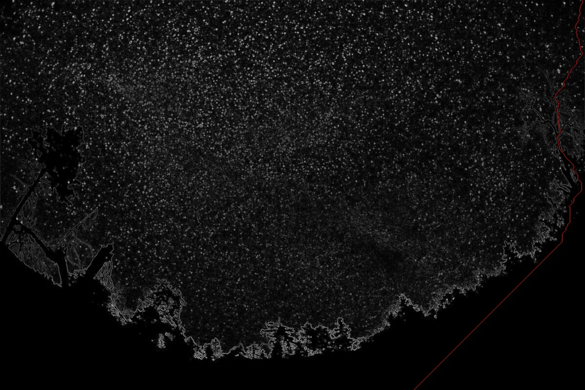
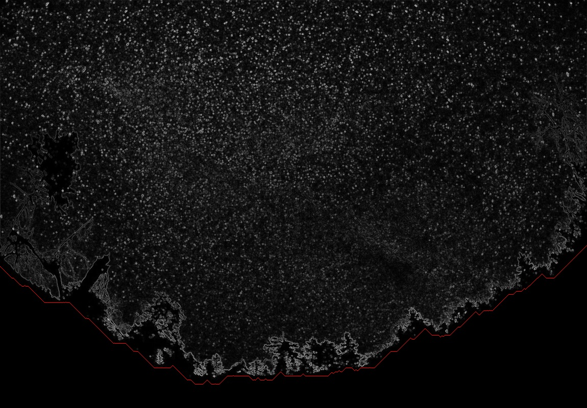

# Seam-Carving

A Python implementation of Seam carving.

Seam carving (or liquid rescaling) is an algorithm for content-aware image resizing.


## Algorithm

1. Energy calculation with Dual-Gradient method
2. Seam identification with a DP algorithm similar to Dijkstra algorithm
3. Seam removal


## How to run

First install requirements
```bash
$ pip install -r requirements.txt
```

Run the script
```bash
$ python SeamCarving.py [INPUT_IMG_PATH] [H_PIXELS] [V_PIXELS] [MODE] [OUTPUT_FOLDER]
```

For example
```bash
$ python SeamCarving.py ../Inputs/In_0.png 50 50 quality 0_q
```

```bash
$ python SeamCarving.py ../Inputs/In_1.jpg 50 50 time 1_t
```


## Results

Input image


Vertical Seam


Horizontal Seam


Output Image reduced 50px in each axis

